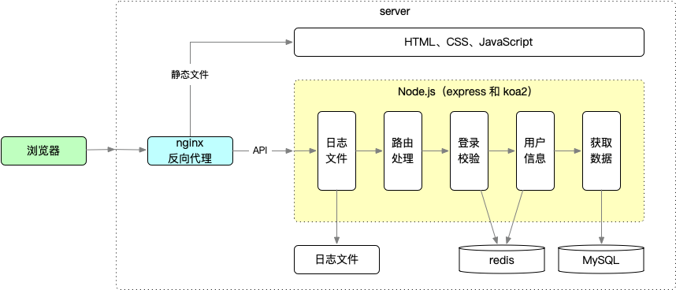

# Node.js 开发 Web Server 博客

## 课程信息

- 课程名称：Node.js+Express+Koa2+开发 Web Server 博客
- 讲师：双越
- 课程链接：<https://coding.imooc.com/learn/list/320.html>

## 课程介绍

- 课程目标：开发 Web Server 博客
- Node.js 的应用场景
  - 运行在服务器，作为 Web Server
  - 运行在本地，作为打包、构建工具
- 课程概述
  - 做什么？Node.js 从入门到实战，开发个人博客系统（后端）
  - 讲什么？API、数据存储、登录、日志、安全
  - 技术？：http、stream、session、mysql、redis、nginx、pm2
- 课程路径
  - 课程准备：Node.js 介绍、服务端特点、案例分析和设计
  - 原生代码：API 和数据存储、登录和 redis、安全和日志
  - 使用框架：express 和 koa2、中间件和插件、中间件原理
  - 线上环境：PM2 介绍和配置、PM2 多进程模型、服务器运维
- 案例架构图
  
- 课程收获
  - 学会使用 Node.js 开发服务端
  - 学会使用服务端的其他工具
  - 学会服务端开发的思想

## 课程笔记

1. [需求与技术方案](./requirement.md)
2. [开发博客系统接口](./interface.md)
