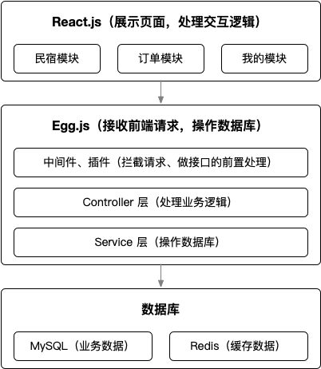

# React+Egg 全栈开发旅游电商应用

## 课程信息

- 课程名称：React+React Hook+Egg 造轮子 全栈开发旅游电商应用
- 讲师：夏小宅

## 课程介绍

- 课程目标：开发旅游电商应用
  - 课程框架：React.js（UmiJs）+ Egg.js
  - 功能模块：
    - 民宿：首页、搜索（滚动加载）
    - 订单：列表、详情、评论、订单（未支付+已支付）
    - 我的：登录、退出、个人信息
- 前端核心技术
  - React.js：主框架
  - UmiJs：React 工具集锦
  - 自定义 hook：提高开发效率
  - think-react-store：React 数据流解决方案
  - Project-libs：常用函数集锦
  - IntersectionObserver：滚动加载、图片、懒加载
- 后端核心技术
  - Egg.js：主框架
  - JWT：用户验证
  - MySQL：数据存储
  - Sequelize：ORM 框架，操作 MySQL
  - 扩展 Egg 框架：提高研发效率
  - 自定义中间件和插件：拦截请求等处理
- 技术架构图
  
- 前端收获
  - 自定义 hook
    - useTitleHook、useHttpHook、useObserverHook、useImageHook
  - 自定义组件
    - CreatePortal、ErrorBoundary、LazyLoad、Modal、MenuBar、ShowLoading
- 后端收获
  - 中间件：httpLog、userExist
  - 插件：egg-auth、egg-info
  - 框架扩展：applicaiton、helper、request、response、context
- 课程路线
  - ① React 基础进阶 → ② 开发组件 → ③ 开发自定义 hook
  - ④ Egg.js 基础 → ⑤ Egg.js 高级
  - ⑥ 前端界面开发 → ⑦ 后端接口开发
  - ⑧ 系统安全处理 → ⑨ 项目部署发布

## 课程笔记
